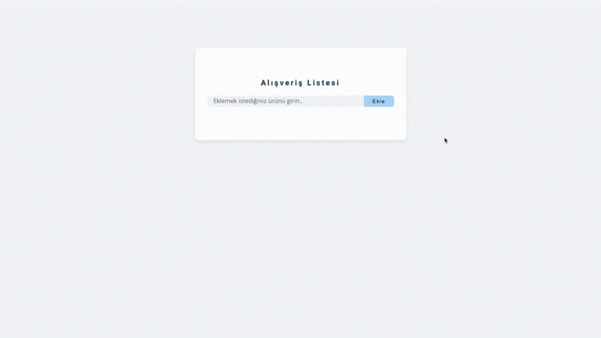

# Shopping Cart

- This is a dynamic web application developed using HTML5, CSS, and JavaScript, designed for creating shopping lists.

- It allows users to easily create, edit, and delete shopping lists. By leveraging the power of JavaScript, the focus is on adding and removing dynamic elements, storing data using local storage, and providing a user-friendly interface.

## GIF

